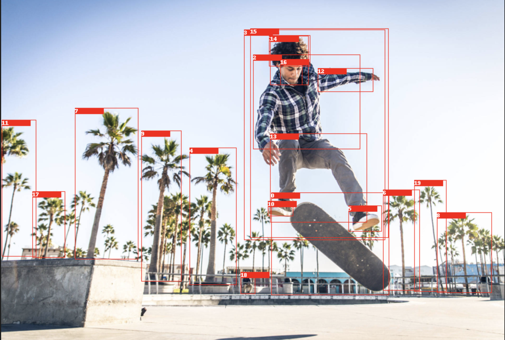
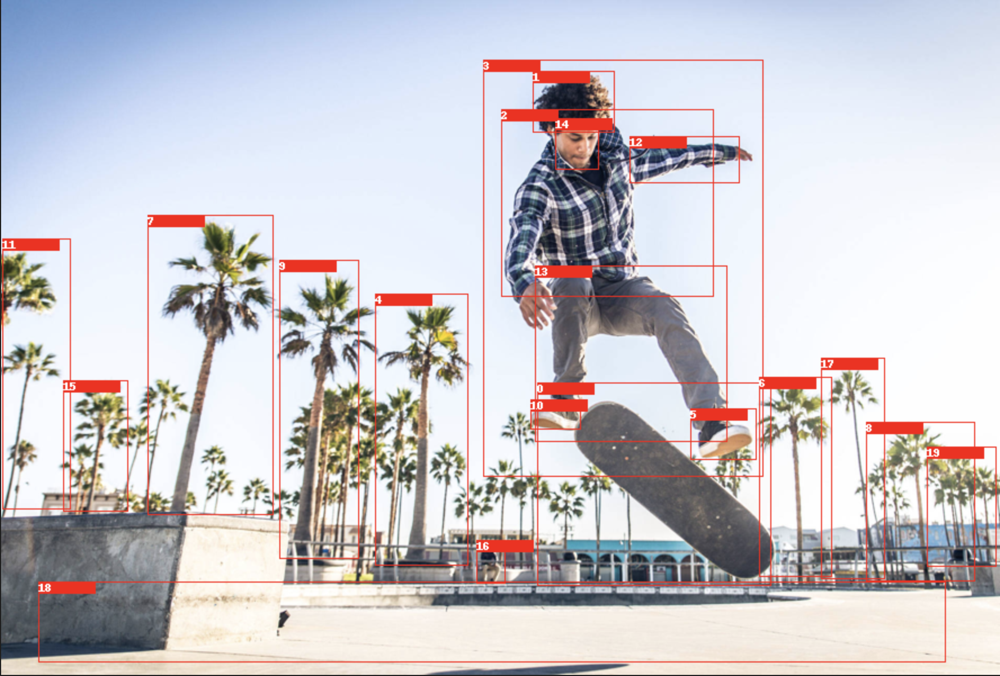
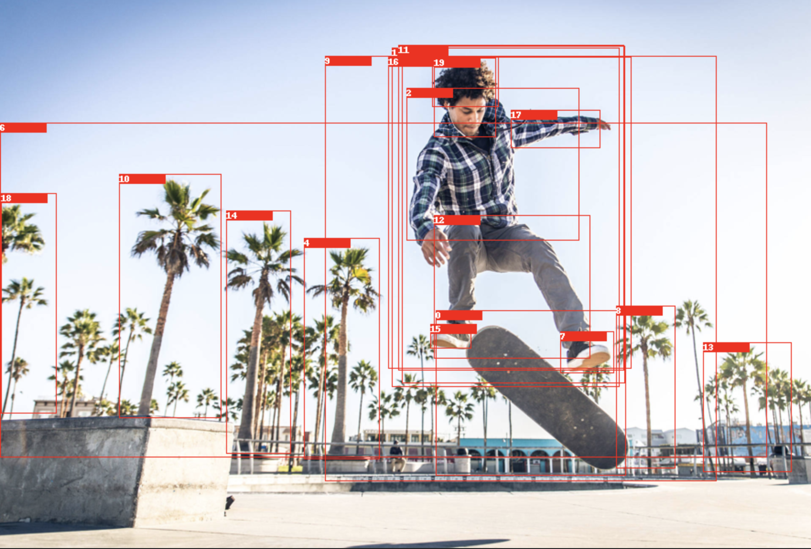
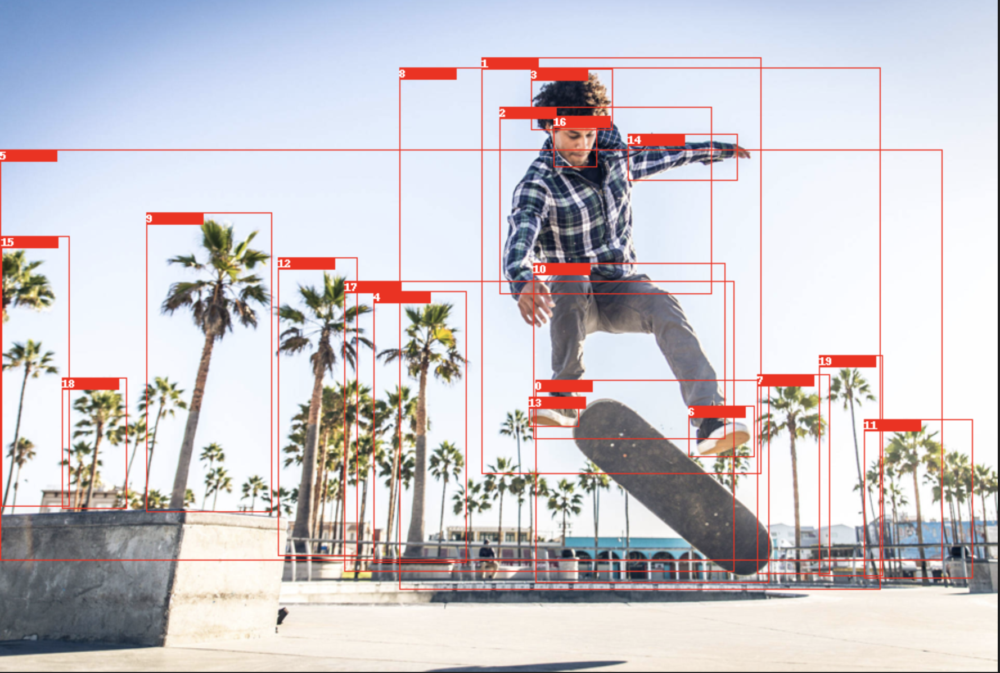

# Scene Graph Refinement with NMS and Gaze Prediction

This project enhances the output of scene graph generators by applying Non-Maximum Suppression (NMS) to reduce overlapping bounding boxes and gaze-based weighting to prioritize visually salient or important regions. The goal is to refine raw scene graph predictions for downstream tasks such as action recognition, captioning, or video summarization.

Features
Gaze Prediction Integration: Uses a pretrained gaze prediction model to assign importance weights to bounding boxes.

Non-Maximum Suppression: Eliminates redundant object detections by keeping only the most relevant bounding boxes.

Scene Graph Enhancement: Produces cleaner, more focused scene graphs suitable for further processing or visualization.

How It Works

Input: Scene graph generator output (e.g., bounding boxes, object labels, relationships).

Non-Maximum Suppression (NMS): Reduces overlapping boxes using an IoU-based threshold.

Gaze Prediction: Computes a saliency map to score boxes based on predicted gaze.

Weighted Filtering: Refines the bounding boxes based on both NMS and gaze scores.

Output: A filtered scene graph with high-confidence and visually important elements.
